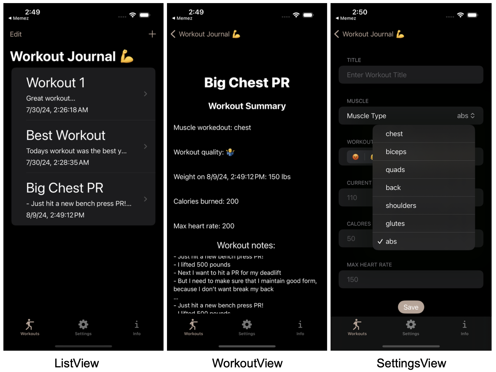
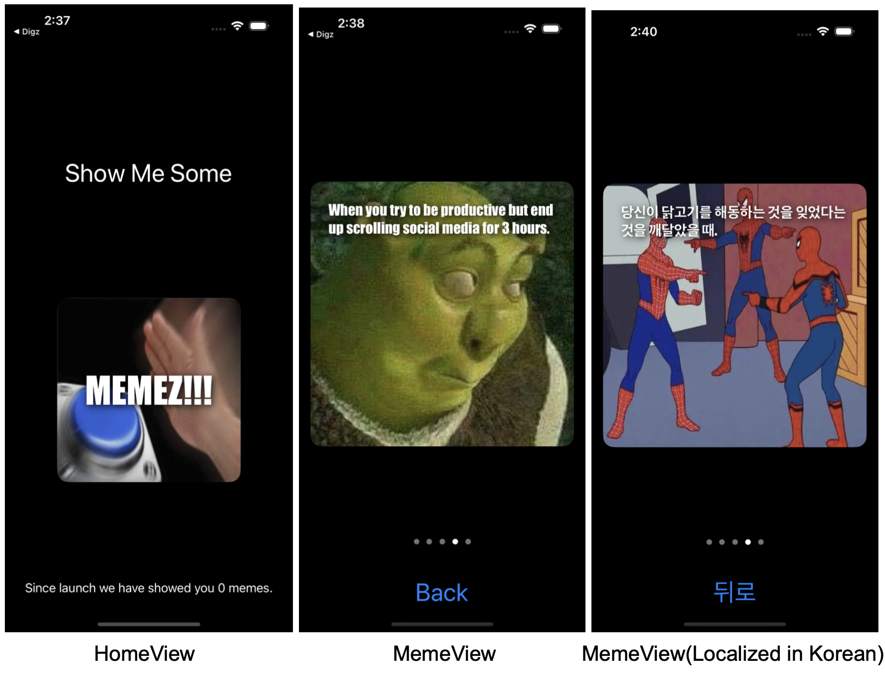
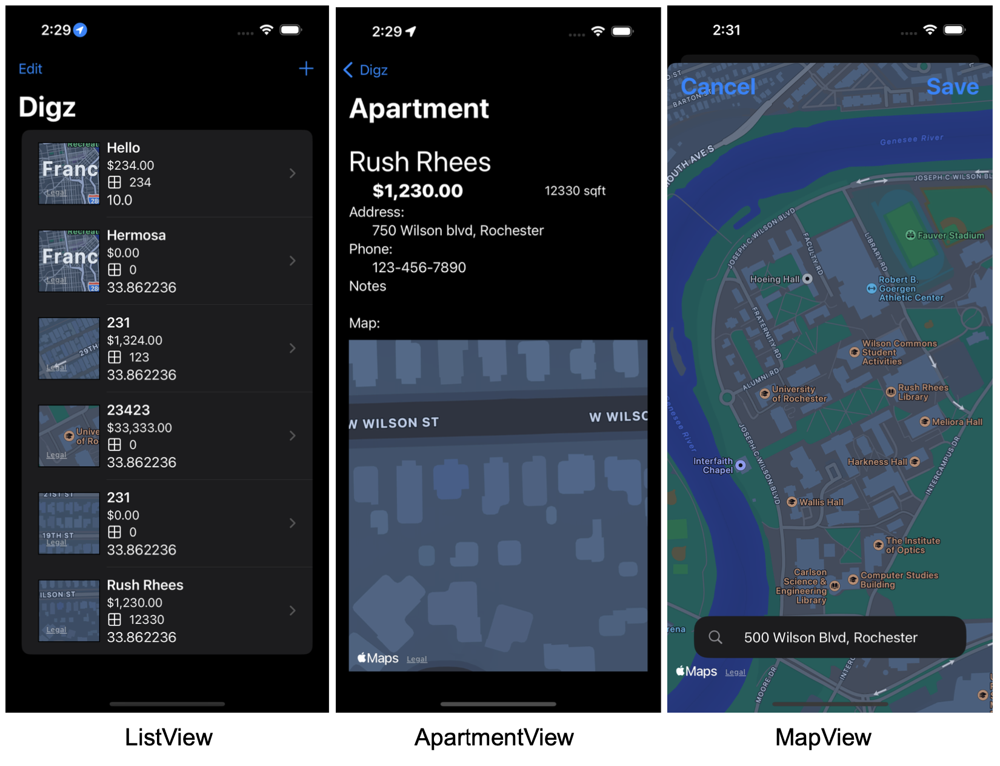
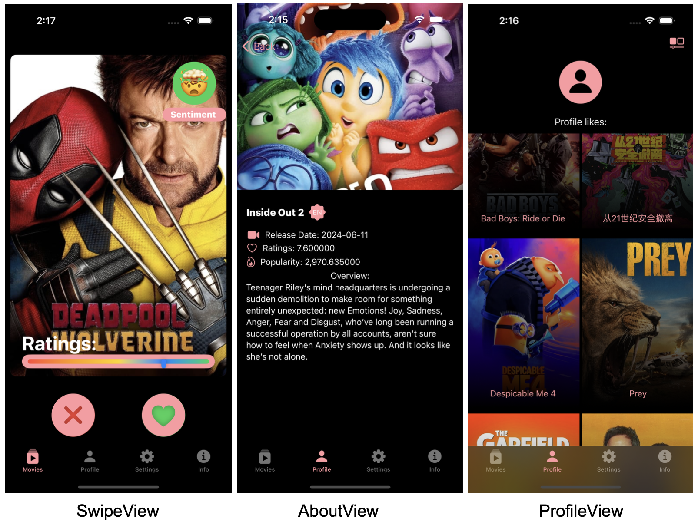

# My IOS Portfolio

Welcome to my IOS app portfolio! This repository showcases several of the projects I have developed during my time at the University of Rochester. Below is an overview of each project, including descriptions and key features.

## Projects

### 1. Workout Journal App
**Date:** August 06, 2024

This project is a workout journal app that allows users to track their workouts effectively. Users can store and list their past workouts using CoreData. Each workout entry allows tracking of the following details:
- Muscle group worked
- Workout quality
- Current weight
- Calories burned during the workout
- Maximum heart rate
- Additional notes

### 2. Meme Generator App (Memez)
**Date:** July 19, 2024

This app is a fun meme generator that creates memes by randomly matching 8 photos with captions. The app can generate up to 64 different meme combinations! Key features include:
- Multi-language support: Localized in both English and Korean.
- Easy meme generation with randomized photo and caption pairing.

### 3. Apartment Journal App (Digz)
**Date:** August 02, 2024

Digz is an app designed to help users keep track of apartments they are interested in. Users can:
- Add apartment details to a list.
- Use MapKit to search for specific apartment addresses.
- Journal their thoughts and impressions about each apartment.

### 4. Movie "Dating" App (CineMate)
**Date:** August 09, 2024

CineMate is a unique "dating" app for movies. It allows users to swipe through different movies and select their favorites. Key features include:
- Movie profile: Selected movies are saved to the user's profile page.
- Info pages: Detailed stats about each movie are available by clicking on movie cards.
- Data sourced from the TMDB API for up-to-date movie information.

